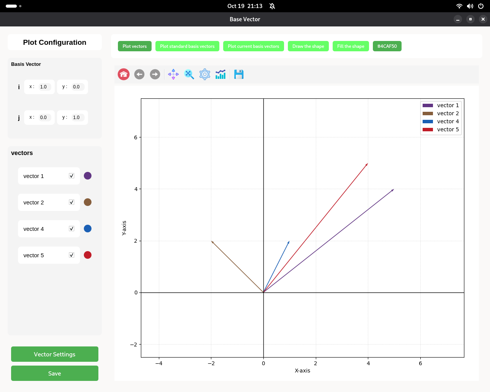
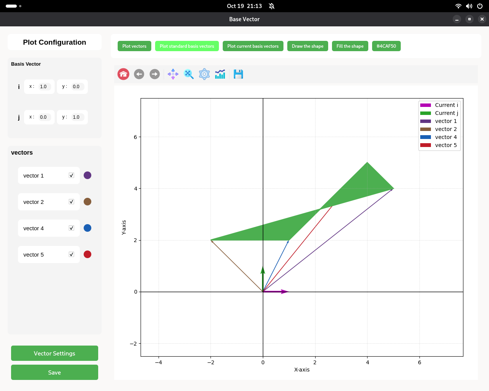
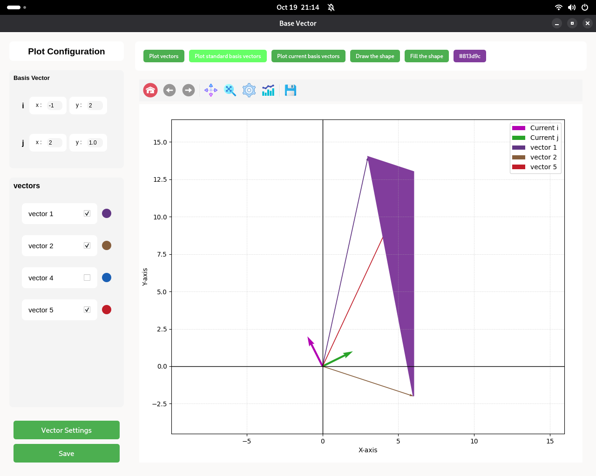
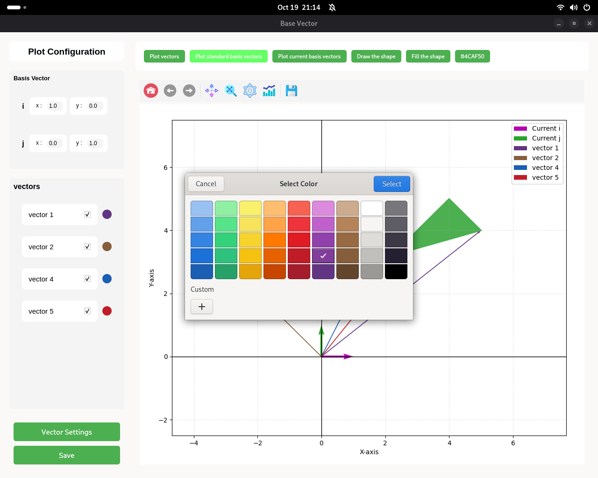
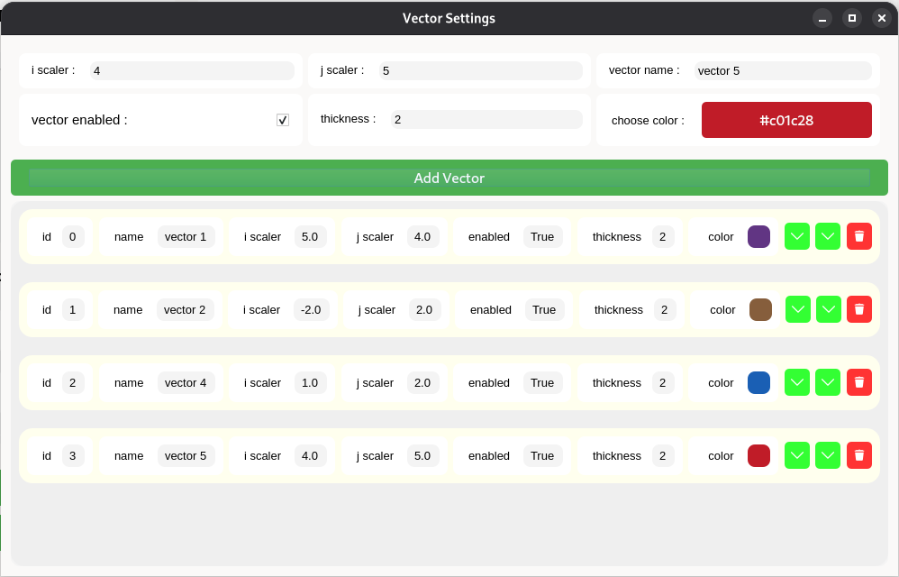

# Basis Vector Visualizer

[](LICENSE)
[](https://pypi.org/project/basisvectorvisualizer/)
[](https://www.python.org/)

**Basis Vector Visualizer** is an interactive tool to help students and enthusiasts understand **basis vectors** and their usage in computer graphics. Users can visualize, manipulate, and create vector spaces, then export their work as SVG or PNG images. This project is written entirely in Python with a responsive GUI using **PySide6**.

---

## Features

- **Interactive Basis Vectors**: Add, remove, and manipulate any number of vectors.
- **Visual Learning**: See how basis vectors combine to create visuals.
- **Save Workspaces**: Save your setups for later.
- **Export Images**: Generate SVG or PNG visualizations.
- **Responsive GUI**: Works on different screen sizes.
- **Educational Focus**: Ideal for students learning linear algebra or graphics.

---

## Installation

Install from PyPI:

```bash
pip install basisvectorvisualizer==1.0.0
```

## Main Window





## Vector Settings Window
